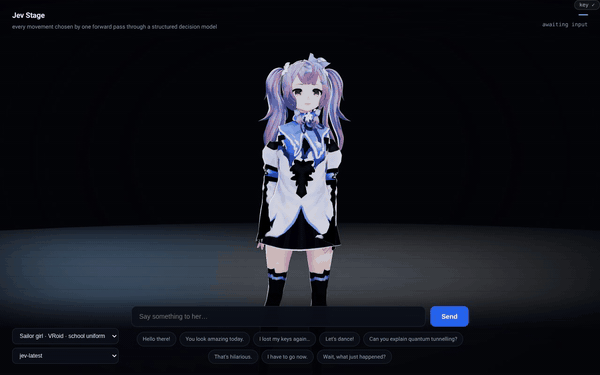

# Jev Stage

**[Open the GitHub Pages stage →](https://gy19a.github.io/jev-stage/)**

The public build contains exactly **CosmicBot**, **Cyberpal** (the visor character),
and the **sailor-uniform anime character**, in that order. Avatar switching, idle
animation and **Preview motion · no AI** work without an API key. Manual previews
are explicitly labelled and do not invent a decision, confidence, or latency.

**API limitation:** GitHub Pages is static hosting, not an inference backend.
TypeSafe currently rejects its browser origin at CORS preflight, so typing a message
requires a key **and** a separately configured trusted proxy; a key alone is not
enough. No proxy, shared credential, private endpoint or existing deployment is
connected to this Pages site. See the [CORS caveat](#the-cors-caveat--read-this-before-you-file-an-issue).

**A 3D avatar that reacts in one forward pass — no text generation, no JSON parsing.**

You type a sentence. A structured-decision model classifies it into one of 14 performance
classes and returns a typed answer with a calibrated probability. The avatar plays the
matching animation. Round trip is typically **170–300 ms**.

There is no chatbot here. Nothing generates a sentence and nothing parses one. The model
returns a `choice` and a confidence number, and the page branches on it the way ordinary
code branches on an enum.



*Every movement above was chosen by a single forward pass. The HUD shows the class, the confidence, and the round-trip time as it happens.*

<sub>Full-resolution captures: [desktop](docs/demo.mp4) · [mobile](docs/demo-mobile.mp4)</sub>

---

## Why this exists

An LLM asked "is this message angry?" writes you a paragraph, and you write a parser. The
parser breaks when the model rephrases. You add retries, then a JSON schema, then a repair
prompt, and you still cannot get a number you can threshold on.

A **System One model** skips that. It reads your candidate labels and returns the
distribution over them directly:

```json
{
  "answers": {
    "emotion": {
      "type": "choice",
      "choice": "greeting",
      "confidence": 1.0,
      "probabilities": {"greeting": 1.0, "sad": 0.0, "angry": 0.0}
    }
  }
}
```

That is the whole contract. `probabilities` is a real distribution, so you can set a
threshold and decide when your software acts on its own and when it asks a human.

This demo is the smallest honest showcase of that idea: a decision loop tight enough that
you watch it happen in real time, on a character that visibly responds.

---

## Run it

It is one HTML file. There is no build step, no bundler, and no backend.

```bash
git clone https://github.com/GY19A/jev-stage.git
cd jev-stage
python3 -m http.server 8080
```

Open `http://localhost:8080` and choose a character or **Preview motion · no AI**.
For model-driven reactions, first resolve the CORS limitation below, then click
**set API key** and provide your own [TypeSafe key](https://console.typesafe.ai/keys).

The key is kept in `localStorage` under `jev-stage.typesafe.key`. It never leaves your
browser except as an `Authorization` header on the API call.

### The CORS caveat — read this before you file an issue

`api.typesafe.ai` **rejects browser requests**. An unauthenticated `OPTIONS` check
with `Origin: https://gy19a.github.io` returned this on 2026-09-19:

```
HTTP 400  Disallowed CORS origin
```

This is deliberate on their side, not a bug in this repo. Server-side calls with the same
key return 200. So a pure-static page cannot call the API directly, and you need a
one-hop proxy that adds nothing but a hostname change.

**Nginx** (for your own separately managed backend):

```nginx
location /ts-api/ {
    proxy_pass https://api.typesafe.ai/;
    proxy_set_header Host   api.typesafe.ai;
    proxy_set_header Origin "";          # the allowlist never sees a browser origin
    proxy_ssl_server_name on;
}
```

**Cloudflare Worker** (free, no server):

```js
export default {
  async fetch(req) {
    const url = new URL(req.url);
    const upstream = "https://api.typesafe.ai" + url.pathname.replace(/^\/ts-api/, "");
    const r = await fetch(upstream, {
      method: req.method,
      headers: { "content-type": "application/json",
                 "authorization": req.headers.get("authorization") },
      body: req.method === "POST" ? await req.text() : undefined,
    });
    const out = new Response(r.body, r);
    out.headers.set("access-control-allow-origin", "*");
    out.headers.set("access-control-allow-headers", "content-type,authorization");
    return out;
  },
};
```

Then point `TS_URL` in `index.html` at your proxy. The proxy adds **no** key — callers
still bring their own, so it cannot spend your credits.

### GitHub Pages deployment

`.github/workflows/pages.yml` runs the regression checks, builds an allowlisted
runtime with `python3 scripts/build_pages.py`, and publishes it through GitHub
Actions. The repository's Pages source must be **GitHub Actions**. Only `index.html`,
the three selected VRMs, the motion files, license notices and a SHA-256 asset
manifest are uploaded. The working tree, tests, screenshots, Git config and local
credentials are never part of the Pages artifact.

```bash
python3 -m unittest discover -s tests -v
python3 scripts/build_pages.py  # creates a fresh .pages-build directory
```

---

## How a message becomes a movement

One request carries the state and every question at once. The questions are evaluated in
parallel against the same state, in isolation from each other, so adding questions barely
moves the latency and none of them pollute the others' context.

```js
{
  model: "jev-latest",
  state: "Let's dance! Turn the music up!",
  questions: {
    emotion: {
      type: "choice",
      instructions: "Which single performance class best fits this message?",
      criteria: {
        excited: "celebration, hype, invitations to play, dancing",
        sad:     "loss, bad news, disappointment",
        angry:   "insults, hostility, frustration",
        /* …14 classes total… */
      }
    },
    energy: {
      type: "choice",
      instructions: "How energetic should the performance be?",
      criteria: { gentle: "soft, subdued", moderate: "normal", high: "big, physical" }
    }
  }
}
```

`criteria` is where the work goes. A class name alone ("excited") makes the model guess
what you meant; a sentence describing *when it applies* pins it down. The difference shows
up exactly on the messages that sit near a boundary.

The answer maps straight to a clip, the idle loop is suspended, the reaction plays, and
idle resumes. No parsing anywhere in that path.

### Observed behavior

Fourteen phrases against the 14 classes, run through the live page:

| Message | Class | Latency |
|---|---|---|
| "Hello there, nice to meet you!" | `greeting` | 305 ms |
| "Let's dance! Turn the music up!" | `excited` | 288 ms |
| "I lost my dog yesterday." | `sad` | 167 ms |
| "You are useless and I hate you." | `angry` | 209 ms |
| "Wait, WHAT just happened?!" | `surprised` | 181 ms |
| "Goodbye, take care." | `farewell` | 240 ms |
| "Haha, you're such a goofball!" | `playful` | 279 ms |

Confidence sits at or near 1.0 on clear cases. Where it drops, it drops for a reason —
"You look amazing today" lands between `happy` and `proud`, and the probability mass
splits accordingly. That is the feature, not a miss: a calibrated model tells you when the
question itself was ambiguous.

---

## What's in the box

`index.html` — the entire application. Three.js scene, VRM loader, animation state
machine, decision client, and key dialog.

**Rendering.** ACES Filmic tone mapping, IBL from a procedural room environment, a
three-light rig with a cool rim, 2048px soft shadows, and a subtle bloom pass gated to a
high threshold so only real speculars glow. The camera drifts on a slow sine so a still
scene never looks frozen.

**Animation.** Reaction clips interrupt the idle loop immediately and hand control back
when they finish. A token guard stops a stale idle timer from stealing the stage
mid-reaction — an easy bug to ship, since the timer fires while the request is still in
flight.

**Mobile.** Portrait layout with the HUD in the header, a horizontally scrolling prompt
rail, and 16px inputs so iOS does not zoom on focus.

---

## Assets and licensing

The three retained avatars carry CC0 in their own embedded VRM metadata. Other
characters are not part of the current source tree or Pages runtime. The animation
license caveat below is pre-existing and remains unresolved; avatar clearance must
not be mistaken for a blanket clearance of every third-party motion file.

### Avatars — all CC0

| File | Character | Source | License |
|---|---|---|---|
| `CosmicBot.vrm` | Cosmic Bot | [ToxSam/open-source-avatars](https://github.com/ToxSam/open-source-avatars) (100Avatars R3) | CC0 1.0, `allowRedistribution: true` |
| `Cyberpal.vrm` | Cyberpal | [ToxSam/open-source-avatars](https://github.com/ToxSam/open-source-avatars) (100Avatars R3) | CC0 1.0, `allowRedistribution: true` |
| `anime_girl.vrm` | おんなのこ１ロング | VRoid Studio base model (pixiv) | CC0 1.0 |

The unused `polydancer.vrm` and `rose.vrm` resources have also been removed so that
the file inventory matches the three-character picker. They were not the three
Nitral characters discussed below; those were already excluded before this update.

Provenance was confirmed by SHA-256 comparison against each upstream download URL, not
inferred from filenames — several had been renamed in transit.

CC0 waives attribution, but credit is deserved: thanks to
**[ToxSam](https://github.com/ToxSam)** and opensourceavatars.com,
**[Polygonal Mind](https://www.polygonalmind.com/)**, and **pixiv / VRoid**.

### Animations

The 11 `.vrma` clips come from [tk256ailab/vrm-viewer](https://github.com/tk256ailab/vrm-viewer),
which ships an MIT `LICENSE` (© 2025 TK256).

**A caveat, stated plainly:** that repo's README also says *"This project is for
demonstration purposes. Please ensure you have appropriate rights for any VRM models and
animations you use."* The repo's code is 100% HTML, so the MIT grant most plausibly covers
the viewer rather than the bundled clips, and the clips carry no embedded license metadata
or named author. I have included them because the repository's own LICENSE file is an MIT
grant with no carve-out, but I would rather flag the ambiguity than quietly rely on it. If
you are shipping something commercial, confirm with the upstream maintainer or swap in
motion you control.

### Deliberately excluded

Three VRoid avatars by *Nitral* (`Velara`, `Onyx`, `Dhahlia`) and nine Mixamo-derived
animation clips were removed before publication.

The avatars carry `allowRedistribution: false` and `modification: prohibited` in their VRM
1.0 metadata. They also carry `commercialUsage: "corporation"` — and **those are
independent permission bits.** Broad commercial *use* rights say nothing about
*redistribution*, and conflating the two is the single easiest way to ship an infringing
asset bundle.

The Mixamo clips fall under Adobe's terms, which permit unlimited commercial use but
explicitly forbid *"any type of free distribution of character or animation raw files."*
Converting FBX to VRMA does not change that.

---

## Credits

Decisions by **[Jev](https://typesafe.ai)**, TypeSafe AI's System One model.
Rendering by **[three.js](https://threejs.org/)** and
**[@pixiv/three-vrm](https://github.com/pixiv/three-vrm)**.

## License

Code in this repository is MIT. Bundled assets keep their own licenses as listed above.
